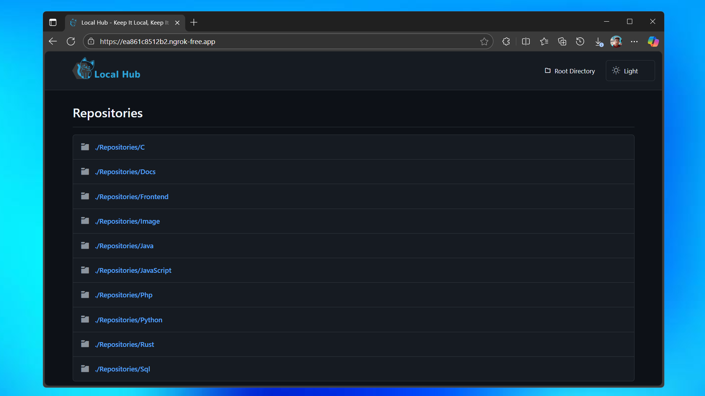
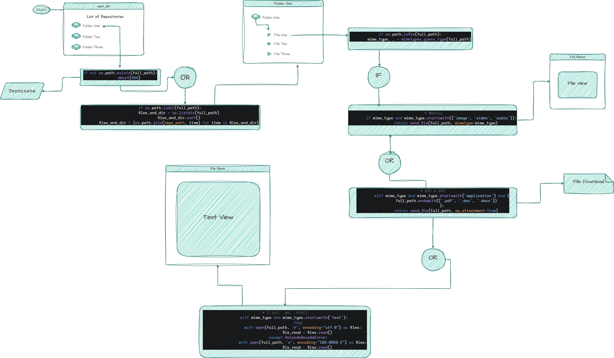

# LocalHub

[](https://github.com/ayahack89/localhub/blob/main/LICENSE)


LocalHub is an open-source framework that provides developers with complete control over their code repositories while enabling secure team collaboration. Built with privacy as a core principle, this framework allows users to store, view, and share repositories without relying on third-party cloud services.

## Overview



The vision behind LocalHub is simple yet powerful: give developers full control over their code, credentials, and repositories without expensive storage subscriptions, premium features, or third-party restrictions.

LocalHub prioritises security, making it an ideal solution for private repositories. Instead of relying on centralized cloud services, your code remains on your own system, ensuring complete ownership and privacy. The framework operates through an Ngrok-exposed local server, allowing secure repository sharing with your team through a one-time authentication process.

This approach ensures that access is temporary and entirely under your control. If you detect any suspicious activity, you can instantly shut down access, protecting your data. LocalHub is more than just a hosting tool—it's a customizable framework that provides essential repository management features while allowing developers to extend and adapt it to their unique needs.

## Architecture



LocalHub follows a lightweight yet powerful architecture that runs within a virtual environment on your local system. The architecture consists of two key components:

### Backend
- Manages repositories, static files, and application views securely
- Includes a caching mechanism to optimize performance
- Handles authentication and access control

### Frontend
- Dynamic templates render and display folders and files from the backend
- Utilizes dynamic routing to provide seamless navigation
- Maintains security by not exposing unnecessary system details

The backend and frontend work together efficiently, ensuring a smooth, secure, and real-time experience for accessing and sharing repositories. By keeping the architecture modular and extendable, LocalHub allows developers to customize and expand functionality based on specific requirements.

## Features

### Core Capabilities
- **Full Code Ownership**: Your repositories stay on your own system, ensuring 100% data control without third-party dependencies
- **Subscription-Free**: No monthly fees or premium features—complete access without restrictions
- **Private Repository Sharing**: Share repositories securely using Ngrok-powered temporary URLs with optional authentication
- **Virtual Environment Stability**: Runs in an isolated Python environment, preventing dependency conflicts
- **Framework Design**: Built as an extendable framework rather than a fixed application
- **Instant Access Control**: Easily start, stop, and reset repository access within seconds

### Security Features
- Local storage ensures data never leaves your control
- Temporary access URLs that can be revoked instantly
- Optional authentication for additional security layers
- No data transmission to external servers

## Requirements

Before installation, ensure your system meets the following requirements:

- **Python**: Version 3.12.4 or later
- **Flask**: Python web framework
- **Ngrok**: For secure tunneling (included in repository)
- **Sufficient Storage**: Based on your repository size (avoid using C:\ drive)

## Installation

### Step 1: Verify Python Installation
```bash
python --version
```

### Step 2: Install Flask
```bash
python -m pip install flask
```

### Step 3: Clone the Repository
```bash
git clone https://github.com/ayahack89/localhub.git
cd localhub
```

### Step 4: Set Up Your Repositories
Place your private repositories, files, and folders in:
```
localhub/venv/Backend/Repositories/
```

## Usage

### Starting LocalHub

1. **Activate the Virtual Environment**
   ```bash
   cd localhub/venv/Scripts/
   activate
   ```
   
   After activation, your terminal should display:
   ```bash
   (.venv) PS D:\your-path\localhub\venv\Scripts>
   ```

2. **Start the Local Server**
   ```bash
   cd ../Backend
   python app.py
   ```
   
   The server will start at: `http://127.0.0.1:5000`

3. **Expose via Ngrok**
   ```bash
   ngrok http 5000
   ```
   
   Ngrok will generate a public URL that you can share with team members.

### Secure Team Collaboration

For enhanced security, enable basic authentication in Ngrok:

```bash
ngrok http 5000 --basic-auth="username:password"
```

This requires users to enter credentials before accessing the repository.

## Configuration

LocalHub can be customized through various configuration options:

- **Authentication Settings**: Configure user access and permissions
- **Repository Organization**: Structure your repositories for optimal access
- **Security Policies**: Set up access controls and monitoring
- **Performance Tuning**: Adjust caching and server settings

## Troubleshooting

### Common Issues

**Flask Module Not Found**
```bash
python -m pip install --upgrade flask
```

**Virtual Environment Issues**
```bash
deactivate
activate
```

**Ngrok Connection Problems**
- Verify Ngrok installation
- Check firewall settings
- Restart the Ngrok service

## Advantages

- **Privacy-First Approach**: Your code remains under your complete control
- **Cost-Effective**: No subscription fees or usage limitations
- **Highly Customizable**: Adapt the framework to meet specific requirements
- **Secure Access Management**: Control who can access your repositories and when
- **Lightweight Operation**: Minimal system resource usage
- **Instant Deployment**: Quick setup and deployment process

## Limitations

- **Technical Knowledge Required**: Basic understanding of command line and networking concepts
- **Local Machine Dependency**: Repository access requires your machine to be online
- **Ngrok Restrictions**: Free plans have session limitations
- **Manual Configuration**: Requires hands-on setup and maintenance

## Contributing

LocalHub is in active development and welcomes contributions from the community. To contribute:

1. Fork the repository
2. Create a feature branch
3. Make your changes
4. Submit a pull request

Please read our contributing guidelines and code of conduct before you submit your contributions.

## Community

Join our growing community of developers who believe in code ownership and privacy:

- **Issues**: Report bugs and request features on GitHub
- **Discussions**: Share ideas and get help from other users
- **Documentation**: Help improve our guides and tutorials

## Roadmap

LocalHub is continuously evolving. Current development focuses include:

- Enhanced security features
- Improved user interface
- Better performance optimization
- Extended customization options
- Mobile-responsive design

## License

This project is licensed under the MIT License - see the [LICENSE](LICENSE) file for details.


> **LocalHub** - Keep It Local, Keep It Secure
