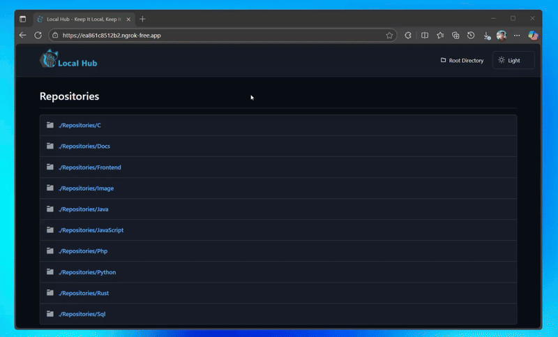
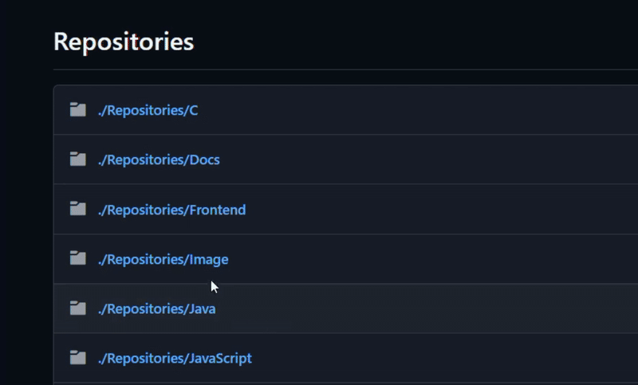

 
`Keep It Local.` `Keep It Secure.` 

Local Hub is an innovative open-source framework designed to give developers complete `control` over their `code` repositories while enabling secure team collaboration. Built with `privacy` as its foundational principle, this powerful solution allows you to store, manage, view, and share repositories without depending on third-party cloud services or expensive subscriptions.

The vision behind Local Hub is both simple and transformative: empower developers with absolute control over their code, credentials, and repositories. Eliminate concerns about monthly subscription costs, premium feature paywalls, and external restrictions. With LocalHub, your code remains securely on your own system, ensuring complete ownership and privacy at all times.

The framework operates through an Ngrok-exposed local server, facilitating secure repository sharing with your team members. You can implement optional one-time authentication processes for enhanced security measures. This approach guarantees that access remains temporary and entirely under your control. Should you detect any suspicious activity, you can immediately terminate access, protecting your valuable intellectual property.


Local Hub transcends being merely a hosting tool; it's a fully customizable framework that provides essential repository management features while allowing developers to extend and adapt it to their unique workflow requirements.


## Architecture

Local Hub employs a lightweight yet powerful architecture that operates within a virtual environment on your local system. The architecture consists of two meticulously designed components that work in harmony:


### Backend
- **Repository Management**: Securely handles all repository operations, including access control and organization
- **Static File Serving**: Efficiently delivers static files with optimized performance
- **View Processing**: Manages application views and templates with security considerations
- **Caching Mechanism**: Implements intelligent caching to enhance response times and reduce server load
- **Authentication System**: Provides flexible authentication options, including optional basic auth protection

### Frontend
- **Dynamic Templates**: Renders and displays folders and files from the backend with real-time updates
- **Dynamic Routing**: Implements seamless navigation between repositories and files without page reloads
- **Security-First Design**: Ensures no unnecessary system details are exposed to users
- **Responsive Interface**: Adapts to different devices and screen sizes for optimal viewing experience

The backend and frontend components work together efficiently, ensuring a smooth, secure, and real-time experience for accessing and sharing repositories. The modular architecture allows developers to customize and expand functionality based on specific requirements, making LocalHub adaptable to various development workflows.


## Features

### Core Capabilities

- **Complete Code Ownership**: Maintain 100% control of your repositories on your own systems without third-party dependencies or data mining concerns
- **Zero Subscription Model**: No monthly fees, no premium features, and no hidden costs, enjoy complete access to all functionality without financial barriers
- **Private Repository Sharing**: Securely share repositories using Ngrok-powered temporary URLs with configurable expiration times and optional authentication requirements
- **Virtual Environment Stability**: Operates within an isolated Python environment, preventing dependency conflicts and ensuring consistent performance across different systems
- **Extensible Framework Design**: Built as a flexible framework rather than a fixed application, allowing for custom modifications and feature additions
- **Instant Access Control**: Easily start, stop, and reset repository access within seconds through simple command-line operations

### Security Features

- **Local Storage Assurance**: Your data never leaves your control or is transmitted to external servers without your explicit permission
- **Temporary Access URLs**: Generate time-limited access links that can be revoked instantly when no longer needed
- **Configurable Authentication**: Implement optional basic authentication for additional security layers when sharing with team members
- **No Data Transmission**: Zero data collection or transmission to external servers, ensuring complete privacy
- **Firewall Friendly**: Operates within your existing security infrastructure without requiring special exceptions

### User Experience

Local Hub gives you the complete GitHub experience on your own system. It's built on a powerful framework but feels just like the real thing. The interface is familiar, making it easy to browse repositories, view files, and navigate around. Because it feels so similar, there's no learning curve, so your team can be productive right away. You get all the powerful workflows you rely on for collaboration, just in your own local environment.



It also works with all the files you use. Code is displayed with proper format to make it easy to read, and everything from documents to images looks great and is easy to view. No matter what you're working on, Local Hub presents it in a clean, logical, and visual way, so your entire project is clear and accessible in one place.




## Requirements

Before installation, ensure your system meets the following requirements:

- **Python**: Version 3.12.4 or later (earlier versions may not be supported)
- **Flask**: Python web framework (will be installed during setup)
- **Ngrok**: For secure tunnelling (included in the repository)
- **Storage Space**: Adequate storage based on your repository size (recommended to avoid using the system drive C:\ for better performance)
- **System Resources**: Minimum 4GB RAM recommended for optimal performance
- **Network Connectivity**: Stable internet connection for Ngrok tunnelling functionality

## Installation

### Step 1: Verify Python Installation
Check that you have the correct Python version installed:
```bash
python --version
```
If you don't have Python 3.12.4 or later, download it from the official Python website before proceeding.

### Step 2: Install Flask
Install the Flask framework using pip:
```bash
python -m pip install flask
```

### Step 3: Clone the Repository
Clone the LocalHub repository to your local machine:
```bash
git clone https://github.com/ayahack89/localhub.git
cd localhub
```

### Step 4: Set Up Your Repositories
Place your private repositories, files, and folders in the designated directory:
```
localhub/venv/Backend/Repositories/
```
You can organize your repositories in subfolders within this directory for better management.

## Usage

### Starting LocalHub

1. **Activate the Virtual Environment**
   Navigate to the Scripts directory and activate the virtual environment:
   ```bash
   cd localhub/venv/Scripts/
   activate
   ```
   
   After successful activation, your terminal prompt will change to indicate the virtual environment is active:
   ```bash
   (.venv) PS D:\your-path\localhub\venv\Scripts>
   ```

2. **Start the Local Server**
   Move to the Backend directory and launch the application:
   ```bash
   cd ../Backend
   python app.py
   ```
   
   The server will start and be accessible at: `http://127.0.0.1:5000`
   You can verify it's working by accessing this URL in your browser.

3. **Expose via Ngrok**
   In a new terminal window, start Ngrok to create a secure tunnel:
   ```bash
   ngrok http 5000
   ```
   
   Ngrok will generate a public URL (such as `https://abc123.ngrok.io`) that you can share with team members for external access.

### Secure Team Collaboration

For enhanced security when sharing with team members, enable basic authentication in Ngrok:

```bash
ngrok http 5000 --basic-auth="username:password"
```

This requires users to enter credentials before accessing the repository, adding an extra layer of protection for your code.

### Managing Access

- **Temporary Sessions**: By default, Ngrok sessions are temporary. For longer access, consider Ngrok's paid plans or alternative tunneling solutions
- **Access Monitoring**: Monitor who accesses your repositories through the Ngrok web interface
- **Instant Revocation**: Simply stop the Ngrok process to immediately terminate all external access

## Configuration

LocalHub offers various configuration options to tailor the experience to your needs:

### Authentication Settings
- Configure multiple user accounts with different permission levels
- Set up access expiration times for shared repositories
- Implement IP whitelisting for additional security

### Repository Organization
- Create nested repository structures for better organization
- Set visibility settings for different repositories
- Configure default access permissions for new repositories

### Security Policies
- Establish password complexity requirements
- Configure session timeout settings
- Set up access logging and monitoring

### Performance Tuning
- Adjust caching strategies for optimal performance
- Configure file size limits for uploads and downloads
- Tune server settings based on your system capabilities

## Troubleshooting

### Common Issues and Solutions

**Flask Module Not Found**
```bash
python -m pip install --upgrade flask
```

**Virtual Environment Issues**
If you encounter problems with the virtual environment:
```bash
deactivate
rmdir /s venv  # Remove the existing environment
python -m venv venv  # Create a new virtual environment
```

**Ngrok Connection Problems**
- Verify Ngrok is properly installed and authenticated
- Check firewall settings to ensure port 5000 is not blocked
- Restart the Ngrok service if connections time out
- Verify your internet connection is stable

**Permission Errors**
- Ensure you have read/write permissions in the repository directory
- Check that your user account has appropriate system privileges

**Performance Issues**
- Clear the cache if repositories are not updating correctly
- Restart the application if response times become slow

## Advantages

- **Privacy-First Approach**: Your code remains under your complete control without external exposure or data mining
- **Cost-Effective Solution**: Eliminate subscription fees and usage limitations associated with commercial platforms
- **Highly Customizable Framework**: Adapt and extend the platform to meet your specific workflow requirements
- **Granular Access Management**: Control who can access your repositories and when with precision
- **Lightweight Operation**: Minimal system resource usage compared to full-featured development platforms
- **Rapid Deployment**: Quick setup process gets you up and running in minutes rather than hours
- **Offline Capability**: Access and work with your repositories even without internet connectivity
- **No Vendor Lock-in**: Freedom to migrate to other solutions without data export complications

## Limitations

- **Technical Knowledge Requirement**: Basic understanding of command line operations and networking concepts is necessary for setup and maintenance
- **Local Machine Dependency**: Repository access requires your machine to be online and running the LocalHub server
- **Ngrok Restrictions**: Free Ngrok plans have session limitations and changing URLs
- **Manual Configuration**: Requires hands-on setup and maintenance compared to managed services
- **Scalability Constraints**: Designed for team collaboration rather than enterprise-scale deployment
- **Network Dependency**: External access quality depends on your internet connection stability

## Contributing

Local Hub is in active development and warmly welcomes contributions from the community. We believe in building together and appreciate all forms of contribution.

### How to Contribute

1. **Fork the Repository**: Create your own copy of the project on GitHub
2. **Create a Feature Branch**: Work on your changes in an isolated branch
3. **Make Your Changes**: Implement your features or fixes with clear, documented code
4. **Test Thoroughly**: Ensure your changes don't break existing functionality
5. **Submit a Pull Request**: Describe your changes and their benefits clearly

### Contribution Guidelines

- Follow existing code style and formatting conventions
- Write clear commit messages explaining the purpose of changes
- Update documentation to reflect any new features or changes
- Ensure your code passes all existing tests
- Add tests for new functionality when appropriate

Please read our detailed contributing guidelines and code of conduct before submitting your contributions to ensure a collaborative and respectful environment.

## Community

Join our community of developers who believe in code ownership and digital privacy:

- **GitHub Issues**: Report bugs, suggest enhancements, and request features directly on our GitHub repository
- **Discussion Forums**: Share ideas, ask questions, and get help from other LocalHub users
- **Documentation Contributions**: Help improve our guides, tutorials, and documentation for better onboarding
- **Feature Requests**: Propose new features and vote on existing proposals to shape LocalHub's future
- **Community Support**: Assist other users and share your implementation experiences

## License

This project is licensed under the MIT License - see the [LICENSE](LICENSE) file for complete details. The MIT License is a permissive free software license that allows reuse within proprietary software provided all copies include the copyright and license terms.

> **LocalHub** - Keep It Local, Keep It Secure
